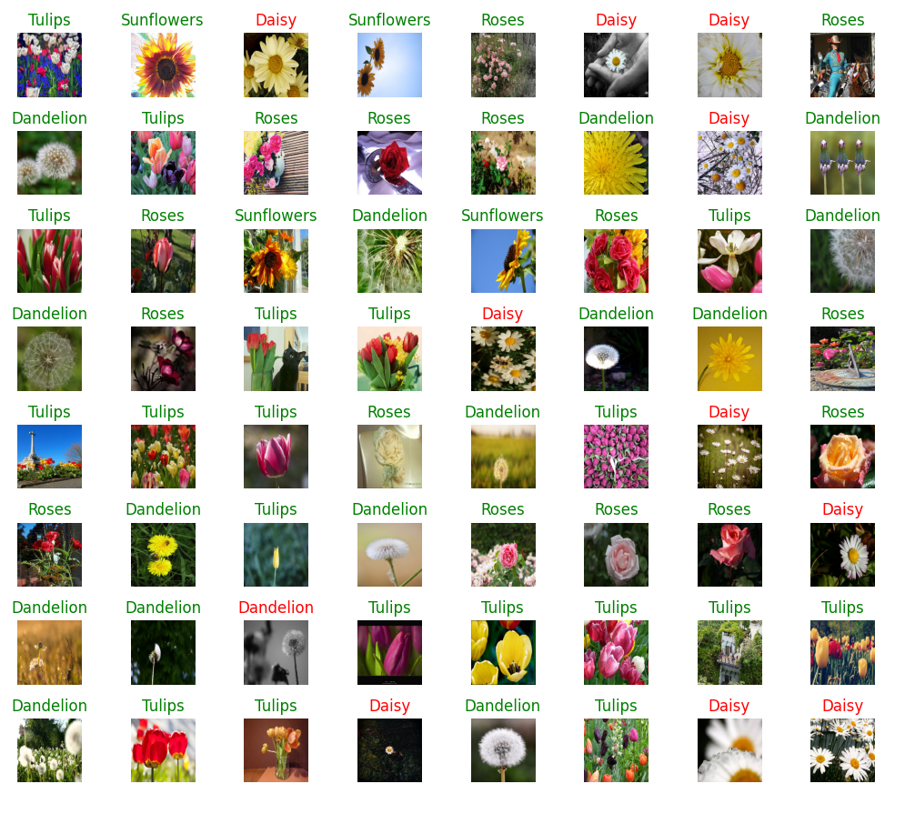

# Tensorflow Hub

Trying out [TensorFlow Hub](https://www.tensorflow.org/hub) to download the feature extraction layer of MobileNet and retrain with the [flower dataset provided by Tensorflow](https://storage.googleapis.com/download.tensorflow.org/example_images/flower_photos.tgz):

* `testing_mobilenet.py`: Test the untrained model
* `training_mobilenet.py`: Train the model and testing

